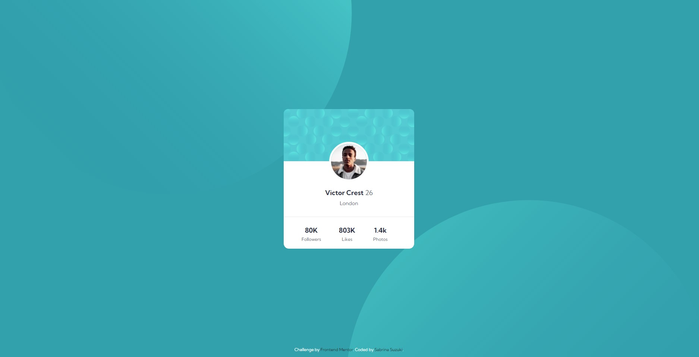

# README

<a href="https://www.frontendmentor.io/challenges/profile-card-component-cfArpWshJ">Link do desafio do projeto</a>

<a href="https://profile-card-desafio-frontendmentor.netlify.app">Ver o projeto</a>

Ainda preciso deixar responsivo.

👽Sabrina Suzuki

